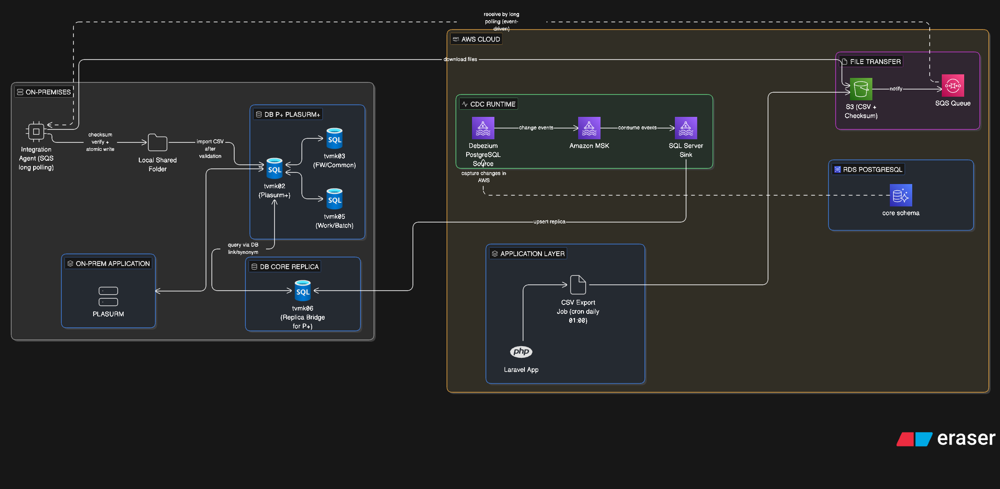

# AWS Migration: Giải Pháp Tích Hợp Database

> **Mục tiêu**: Giải quyết các vấn đề tích hợp database khi migrate **DB Core (tvmk06)** sang PostgreSQL trên AWS, trong khi **DB P+ / PSM+ (tvmk02, tvmk03, tvmk05)** vẫn được **giữ nguyên hoàn toàn trên on-premises**.

**Mapping với source hiện tại:**

| Thành phần          | Trong repo / thực tế hiện tại                                      |
|---------------------|---------------------------------------------------------------------|
| Ứng dụng            | Java + Tomcat + yhFramework (servlets, online batch, scheduler)   |
| DB Core             | **`tvmk06`** (Core System) → Migrate toàn bộ lên PostgreSQL trên AWS |
| DB P+ / PSM+    | **`tvmk02`** (PSM+ chính), tvmk03 (FW/Common), tvmk05 (Work/Batch) → **Giữ nguyên** trên SQL Server on-premises |
| Vai trò tvmk06 sau migrate | Chỉ còn là **DB replica/read-side on-prem** nhận đồng bộ từ AWS (không còn là DB xử lý chính) |

**Nguyên tắc thiết kế quan trọng:**
- DB Core (tvmk06) sẽ được migrate và vận hành hoàn toàn trên AWS PostgreSQL.
- tvmk06 on-prem **không bị xóa ngay**, chỉ thay đổi role thành DB replica nhận đồng bộ một chiều từ AWS PostgreSQL.
- DB P+ (tvmk02 và các DB liên quan) vẫn giữ nguyên logic hiện tại và tiếp tục truy vấn qua DB link/synonym sang `tvmk06`.
- `tvmk06` được định nghĩa chính thức là **Compatibility Replica cho hệ legacy**: không phải nguồn dữ liệu chính và không được phép ghi trực tiếp bởi user nghiệp vụ.

**Identity Governance Rule (bắt buộc):**
- Replica tables trên `tvmk06` **không dùng IDENTITY auto increment** cho cột khóa replicate.
- Giá trị PK phải được replicate 100% từ PostgreSQL source.
- Không để SQL Server tự generate surrogate key cho bảng replicate.

## Data Ownership & Write Authority Model

| Domain / Schema | System of Record | Allowed Write Location | Read Location |
|-----------------|------------------|------------------------|--------------|
| Core Domain | AWS PostgreSQL | AWS only | AWS + `tvmk06` (replica) |
| PSM Domain | On-Prem SQL Server (`tvmk02/tvmk03/tvmk05`) | On-Prem only | On-Prem |
| `tvmk06` Replica | No ownership (compatibility replica) | CDC Sink account only | `tvmk02` (read-only via DB link/synonym) |

**Kiến trúc tổng quát:**
`AWS Core PostgreSQL (source of truth) -> Replication runtime on AWS (Debezium/MSK/Sink) -> tvmk06 SQL Server 2012 (replica sink) -> tvmk02 query via DB link/synonym`

---

## PHẦN 1: GIẢI PHÁP TÍCH HỢP DATABASE

### Giải Pháp 1: Debezium CDC + Change Stream (Đồng bộ DB Core từ AWS xuống tvmk06)

**Mục đích**: Giữ cơ chế Linked Server + Synonym hiện tại cho PSM, đồng thời đổi nguồn dữ liệu chính sang AWS.

**Kiến trúc cốt lõi**:
- DB Core mới → **Migrate full** sang RDS PostgreSQL trên AWS và trở thành **source of truth**.
- `tvmk06` on-prem → chuyển thành **read replica / integration-side DB** để `tvmk02` tiếp tục truy vấn như cũ.
- Sử dụng CDC pipeline với **Debezium PostgreSQL Source Connector** + Kafka + SQL Server sink để đồng bộ một chiều từ AWS về `tvmk06`.

**Quy trình hoạt động chi tiết:**
1. Bật logical replication/CDC trên PostgreSQL AWS cho các bảng Core cần publish.
2. **Debezium Source Connector** thực hiện **Initial Snapshot** (full load) từ AWS Core.
3. Debezium connector liên tục capture thay đổi (INSERT/UPDATE/DELETE) và đẩy events vào Amazon MSK (Kafka).
4. Sink connector nhận events và **upsert** vào SQL Server `tvmk06` (schema tương thích với synonym hiện tại).
5. PSM (`tvmk02`) tiếp tục truy vấn `tvmk06` qua DB link/synonym như trước, không phải đổi lớn ở tầng ứng dụng cũ.

**Lợi ích chính:**
- AWS Core trở thành nguồn dữ liệu chính, tách khỏi ràng buộc on-prem.
- Giữ nguyên cơ chế truy vấn cũ của PSM qua `tvmk02` -> `tvmk06`.
- Giảm rủi ro sửa code lớn ở hệ thống legacy trong giai đoạn chuyển tiếp.
- Có thể mở rộng event stream cho audit, reconciliation, observability.

**Rủi ro & Biện pháp giảm thiểu:**
| Rủi ro                              | Mức độ | Biện pháp giảm thiểu                              |
|-------------------------------------|--------|---------------------------------------------------|
| Lag CDC > 5 giây                    | Trung bình | Giám sát Kafka lag qua CloudWatch + alert tự động |
| Schema PostgreSQL hoặc schema replica tvmk06 thay đổi | Cao    | Áp dụng schema governance + migration kiểm soát tương thích |
| Initial Snapshot chậm do data lớn   | Thấp   | Thực hiện ngoài giờ cao điểm, chia batch         |

**Chi phí phát sinh ước tính (tháng):**
- Amazon MSK (small cluster) + connector runtime: **$48 – $100**
- **Tổng thêm cho CDC/replication**: khoảng **$60/tháng**

---

### Giải Pháp 2: S3 + SQS + Integration Agent (Thay thế cơ chế Shared Folder)

**Quy trình mới** (DB P+ vẫn giữ nguyên, tvmk06 là DB replica/read-side):
1. Core App (AWS) tạo file CSV.
2. Upload CSV + checksum `.sha256` lên Amazon S3.
3. Gửi message qua Amazon SQS.
4. Integration Agent (on-prem) nhận message qua **SQS long polling**, tải file từ S3, kiểm tra checksum và ghi atomic vào thư mục cục bộ.
5. PSM+ (tvmk02) tiếp tục import như cũ.

**Lợi ích**: Giữ nguyên logic PSM+ mà không cần mount shared folder từ AWS.

**Rủi ro & Biện pháp giảm thiểu:**
| Rủi ro                              | Mức độ | Biện pháp giảm thiểu                              |
|-------------------------------------|--------|---------------------------------------------------|
| File CSV hỏng khi truyền            | Trung bình | Kiểm tra checksum SHA256 bắt buộc                 |
| Integration Agent downtime          | Cao    | Chạy dưới dạng service với auto-restart           |

**Chi phí phát sinh ước tính (tháng):**
- S3 + SQS: **$12 – $20**
- **Tổng thêm**: khoảng **$16/tháng**

---

## PHẦN 2: TÓM TẮT CHI PHÍ PHÁT SINH TOÀN BỘ

| Hạng mục                  | Chi phí ước tính / tháng (USD) |
|---------------------------|--------------------------------|
| Debezium CDC (MSK)        | 60                             |
| S3 + SQS + Agent          | 16                             |
| **Tổng chi phí phát sinh** | **≈ 76 USD/tháng**            |

**Lưu ý**: Chi phí có thể giảm thêm khi dùng MSK Serverless hoặc tối ưu instance.

**Lưu ý phạm vi chi phí**: Chưa bao gồm chi phí Direct Connect/VPN, data transfer liên vùng/egress và chi phí nhân sự vận hành (Ops).

---

## KẾT LUẬN

Với thiết kế này:
- **DB Core chính** được migrate và vận hành hoàn toàn trên AWS PostgreSQL.
- `tvmk06` on-prem chuyển thành **replica/read-side DB** nhận đồng bộ từ AWS.
- **DB P+ (tvmk02, tvmk03, tvmk05)** giữ nguyên logic và tiếp tục truy vấn qua DB link/synonym hiện có.
- Toàn bộ tích hợp được xử lý an toàn, hiệu suất cao, có cơ chế retry và giám sát rõ ràng.
- Đây là **kiến trúc chuyển tiếp (Transitional Architecture)**, không phải target end-state cuối cùng.
- Chiến lược thiết kế ưu tiên:
  - Giảm rủi ro thay đổi hệ legacy.
  - Cô lập write authority về AWS Core.
  - Chấp nhận eventual consistency có kiểm soát bằng SLA + monitoring + reconciliation.

# Tổng quan:

**Biểu đồ tổng quan (diagram-as-code)**



```text
// On-Premises Environment
"On-Premises" [color: gray, icon: server] {

  // Application Layer (On-Prem)
  On-Prem Application [icon: layers] {
    Tomcat PSM [icon: server, label: "PSM"]
  }

  DB Core Replica [icon: database] {
    "tvmk06 On-Prem" [icon: azure-sql-database, label: "tvmk06 (Replica Bridge for P+)"]
  }

  DB P+ PSM+ [icon: database, color: blue] {
    tvmk02 [icon: azure-sql-database, label: "tvmk02 (PSM+)"]
    tvmk03 [icon: azure-sql-database, label: "tvmk03 (FW/Common)"]
    tvmk05 [icon: azure-sql-database, label: "tvmk05 (Work/Batch)"]
  }

  Integration Agent [icon: cpu, label: "Integration Agent (SQS long polling)"]
  Local Shared Folder [icon: folder]
}

// AWS Cloud Environment
AWS Cloud [color: orange, icon: aws] {
  Application Layer [icon: layers] {
    PHP App [icon: php, label: "Laravel App"]
    CSV Export Job [icon: file, label: "CSV Export Job (cron daily 01:00)"]
  }

  RDS PostgreSQL [icon: aws-rds] {
    Core Schema [icon: aws-aurora, label: "core schema"]
  }

  CDC Runtime [color: green, icon: activity] {
    Debezium Source [icon: aws-msk, label: "Debezium PostgreSQL Source"]
    MSK Kafka [icon: aws-msk, label: "Amazon MSK"]
    Sink Connector [icon: aws-msk, label: "SQL Server Sink"]
  }

  File Transfer [color: purple, icon: file] {
    S3 Bucket [icon: aws-s3, label: "S3 (CSV + Checksum)"]
    SQS Queue [icon: aws-sqs, label: "SQS Queue"]
  }
}

// Core -> PSM one-way replication
Core Schema --> Debezium Source: capture changes in AWS
Debezium Source > MSK Kafka: change events
MSK Kafka > Sink Connector: consume events
Sink Connector > "tvmk06 On-Prem": upsert replica

// Legacy query path
tvmk02 <> "tvmk06 On-Prem": query via DB link/synonym
On-Prem Application <> tvmk02
tvmk02 <> tvmk03
tvmk02 <> tvmk05

// File transfer path
PHP App > CSV Export Job
CSV Export Job > S3 Bucket
S3 Bucket > SQS Queue: notify
Integration Agent <-- SQS Queue: receive by long polling (event-driven)
Integration Agent > S3 Bucket: download files
Integration Agent > Local Shared Folder: checksum verify + atomic write
Local Shared Folder > tvmk02: import CSV after validation
```

**Luồng chính**
- Luồng chính: `AWS core(PostgreSQL) -> Debezium CDC Runtime(AWS) -> tvmk06(SQL Server 2012 replica bridge)`.
- Luồng truy vấn legacy: `tvmk02/PSM -> DB link/synonym -> tvmk06`.
- Luồng CSV một chiều: `CSV Export Job (daily 01:00) -> S3 + SQS -> Integration Agent (SQS long polling) -> checksum verify + atomic write -> tvmk02 import`.
- Không sử dụng Outbox trong phạm vi thiết kế hiện tại để giảm độ phức tạp.

**Quy tắc vận hành**
- `core` trên AWS là **source of truth** cho domain Core.
- `tvmk06` là **compatibility bridge** cho PSM đọc theo cơ chế cũ.
- Account nghiệp vụ on-prem phải **read-only** trên vùng bảng replicated ở `tvmk06`.
- Chỉ replication sink account được phép ghi vào vùng replicated trên `tvmk06`.

---

## PHẦN 3: ĐIỀU KIỆN CẦN & RISK CHO PHƯƠNG ÁN GIỮ DB LINK

> **Phương án áp dụng**: Giữ cơ chế DB Link/Synonym hiện tại cho PSM (`tvmk02` -> `tvmk06`), nhưng đổi vai trò `tvmk06` thành DB replica nhận dữ liệu một chiều từ AWS PostgreSQL.

### 3.0 CDC nằm ở đâu? SQL Server 2012 cần cài gì?

- Replication runtime nằm ở **AWS** (Debezium Source + MSK + Sink Connector), `tvmk06` không chứa logic CDC.
- `tvmk06` SQL Server 2012 là **đích nhận dữ liệu (sink)**, không phải nguồn CDC trong phương án này.
- SQL Server 2012 **không cần bật SQL Server CDC** cho phương án AWS -> `tvmk06`.
- SQL Server 2012 **không cần cài Debezium** hoặc plugin CDC trong DB engine.
- Việc cần làm trên `tvmk06`: mở port kết nối, cấp quyền ghi cho user sink, đảm bảo PK/index/upsert key, theo dõi lock và transaction log.

### 3.0.1 Consistency Model (bắt buộc công bố cho business)

- Mô hình dữ liệu giữa AWS Core và `tvmk06` là **Eventual Consistency** (asynchronous replication).
- **Không đảm bảo read-after-write tức thì** ở phía PSM (`tvmk02` đọc qua `tvmk06`).
- SLA replication lag mục tiêu: **< 30 giây** trong trạng thái vận hành bình thường.
- Khi lag vượt SLA, hệ thống vẫn chạy nhưng dữ liệu ở PSM có thể trễ so với AWS Core.

### 3.0.2 Recovery Objective

- RPO (Replication path): **<= 5 phút** trong worst-case incident.
- RTO (Connector restart / replication recovery): **<= 30 phút**.

### 3.0.3 Transaction Semantics

- Thứ tự thay đổi trong cùng một transaction PostgreSQL được bảo toàn trên stream.
- Không đảm bảo atomic multi-table read consistency tức thì tại replica `tvmk06`.
- PSM không được giả định strong consistency cho query join nhiều bảng vừa cập nhật.

### 3.1 Điều kiện cần để triển khai

| Nhóm điều kiện | Điều kiện bắt buộc | Ghi chú triển khai |
|----------------|--------------------|--------------------|
| Kết nối mạng AWS -> On-Prem | Có đường kết nối riêng (Site-to-Site VPN hoặc Direct Connect) từ VPC AWS về DC on-prem | Không dùng public Internet cho kết nối DB |
| Firewall / Port | Mở chiều AWS -> On-Prem cho các cổng cần thiết: `1433/TCP` (SQL Server `tvmk06`), `9092/TCP` (nếu self-managed Kafka), `443/TCP` (AWS API/S3/SQS/CloudWatch) | Chỉ allow theo source CIDR/SG cụ thể, không mở rộng toàn mạng |
| DNS / Name resolution | AWS resolve được host on-prem (ví dụ `tvmk06`) và on-prem resolve được endpoint AWS cần dùng | Bắt buộc có DNS forwarding hoặc host mapping chuẩn |
| Runtime Integration Agent (on-prem) | Cài AWS SDK/client cho S3 + SQS, bật TLS, cấu hình SQS long polling | Khuyến nghị `WaitTimeSeconds=20` để giảm số lần quét |
| IAM quyền tối thiểu cho Agent | Cấp `sqs:ReceiveMessage/DeleteMessage/ChangeMessageVisibility` và `s3:GetObject` (thêm `ListBucket` nếu cần) | Dùng credential ngắn hạn/rotation, không hardcode access key |
| Cấu hình SQL Server `tvmk06` | Bật chế độ nhận upsert từ pipeline (JDBC sink/agent), tối ưu index theo key đồng bộ, đủ log file | Kiểm soát lock escalation để tránh ảnh hưởng truy vấn từ `tvmk02` |
| Read-Only Contract cho schema replicate trên `tvmk06` | Bắt buộc enforce permission ở DB level: `REVOKE INSERT/UPDATE/DELETE`, chỉ `GRANT SELECT` cho user PSM (`tvmk02`) | Tránh hot-fix ghi trực tiếp làm phá consistency |
| Lock strategy cho SQL Server 2012 | Bật `READ_COMMITTED_SNAPSHOT ON`, sink batch size nhỏ (`100-500`), index đầy đủ theo business key/upsert key | Giảm blocking ngẫu nhiên khi vừa đọc vừa replicate |
| Cấu hình PostgreSQL AWS | Bật logical replication/CDC theo công nghệ chọn, có user chỉ đọc CDC stream | Tách quyền rõ ràng: user app và user CDC |
| Giữ tương thích schema | Bảng/cột/index/collation trên `tvmk06` phải giữ contract cũ để synonym/query từ `tvmk02` chạy được | Đây là điều kiện sống còn để không sửa nhiều code PSM |
| Phân quyền DB Link/Synonym | `tvmk02` vẫn truy vấn được object synonym trỏ sang `tvmk06`; không đổi tên object đột ngột | Chuẩn bị script verify sau cutover |
| Quan trắc & cảnh báo CDC | Dashboard bắt buộc gồm `replication delay (seconds)`, `Kafka consumer lag`, `sink throughput`, `error rate` | Alert theo ngưỡng: warning `>30s`, critical `>300s` |
| Quy trình vận hành | Có runbook: restart connector, re-sync từng bảng, rollback về snapshot trước cutover | Có đầu mối trách nhiệm rõ (Infra/DBA/App) |

### 3.1.0 Time Sync Requirement

- AWS và On-Prem bắt buộc đồng bộ NTP.
- Sai lệch thời gian giữa các hệ thống không vượt quá **1 giây**.
- Đây là điều kiện nền tảng cho replication lag measurement, reconciliation theo timestamp và điều tra sự cố.

### 3.1.1 Isolation & Locking Strategy (SQL Server 2012)

- Bật `READ_COMMITTED_SNAPSHOT ON` cho `tvmk06`.
- Sink connector dùng batch size nhỏ (`100-500`) để tránh lock escalation khi replay lớn.
- Upsert theo key business (MERGE/key-based upsert) và bắt buộc có index đầy đủ trên key đó.
- Tránh full table scan trong pipeline replay/reconciliation.

### 3.1.2 Data Reconciliation Strategy

- Daily reconciliation job:
  - `COUNT(*)` theo từng bảng trọng yếu.
  - Checksum theo partition key hoặc theo ngày.
- Weekly deep validation:
  - Compare `MAX(updated_at)` theo từng bảng.
- Khi mismatch:
  - Re-sync theo bảng hoặc theo time-window bị lệch.

### 3.1.3 Bulk Change Governance

- Không thực hiện bulk `UPDATE/DELETE` lớn trong giờ cao điểm.
- Với migration script tác động lớn (ví dụ `> 1M rows`):
  - Thực hiện ngoài giờ.
  - Theo dõi sink throughput và log growth trong suốt quá trình replay.

### 3.2 Danh sách risk cần xử lý trước Go-Live

| Risk | Mức độ | Tác động | Biện pháp xử lý |
|------|--------|----------|-----------------|
| PSM vẫn ghi vào các bảng đang coi là replica (`TM_KWSRT`, `TW_SGJSKRNKI`, `TW_SYHJSKRNKI`, `TT_TVMKURGSWK`...) | Rất cao | Xung đột dữ liệu hai chiều, mất nhất quán | Khóa chức năng ghi tương ứng hoặc tách riêng bảng ghi nghiệp vụ trước cutover |
| Replication lag cao giờ cao điểm | Cao | `tvmk02` đọc dữ liệu trễ so với Core AWS | Thiết lập SLA lag, autoscale connector, tăng partition/throughput, cảnh báo sớm |
| Mismatch kiểu dữ liệu/collation PostgreSQL -> SQL Server | Cao | Lỗi insert/update, sai so sánh chuỗi tiếng Nhật | Định nghĩa mapping chuẩn từng cột, test full regression theo bảng trọng yếu |
| Identity/Sequence drift giữa PostgreSQL và SQL Server | Cao | Insert fail hoặc key mismatch | Không để SQL Server tự generate identity cho bảng replicate; replicate full value từ source; tắt/khóa auto increment ở target replicate |
| Mất kết nối AWS <-> On-Prem | Cao | Replica ngừng cập nhật, backlog tăng | Thiết kế retry + backoff, queue buffer, cảnh báo NOC, runbook failover |
| Lỗi thứ tự event (out-of-order) | Trung bình | Dữ liệu cuối cùng sai trạng thái | Upsert idempotent theo business key + version/timestamp |
| Schema thay đổi từ Core AWS nhưng chưa rollout xuống `tvmk06` | Cao | Connector lỗi hàng loạt, dừng đồng bộ | Quản trị schema bằng change pipeline bắt buộc (migrate script + kiểm tra tương thích) |
| Tắc nghẽn/lock trên `tvmk06` khi vừa đọc nhiều từ `tvmk02` vừa ghi replicate | Cao | Query chậm, timeout nghiệp vụ | Tuning index, batch size, isolation level; tách khung giờ bulk load |
| Không có cơ chế đối soát dữ liệu định kỳ | Cao | Sai lệch âm thầm khó phát hiện | Chạy reconciliation hằng ngày (count/checksum theo partition key) |
| Thiếu kế hoạch rollback | Rất cao | Sự cố kéo dài, ảnh hưởng nghiệp vụ | Chuẩn bị sẵn snapshot/mốc dữ liệu + kịch bản quay lui trong 30-60 phút |

### 3.3 Failure Scenario: CDC bị dừng/chết thì sao?

- Nếu Debezium/MSK/Sink dừng:
  - AWS PostgreSQL Core vẫn xử lý transaction bình thường.
  - PSM vẫn đọc được dữ liệu cũ trên `tvmk06`.
  - Hệ thống **không outage**, chỉ **thiếu cập nhật mới** sang phía PSM.
- Đây là trạng thái **degraded eventual consistency**, không phải sập toàn hệ thống.
- Runbook bắt buộc:
  1. Restart connector/runtime.
  2. Kiểm tra offset/lag và error topic.
  3. Re-sync phạm vi bị lỗi (theo bảng hoặc theo time window).
- Trường hợp **network partition kéo dài > 24h**:
  - Kafka backlog có thể tăng mạnh.
  - SQL Server transaction log có thể tăng nhanh trong giai đoạn replay.
  - Biện pháp: giới hạn retention topic hợp lý, giám sát log growth, và cho phép truncate + resnapshot theo bảng khi cần.
- Trường hợp **schema drift trong lúc replication đang chạy**:
  - Nếu Core deploy `ALTER TABLE` không tương thích, sink có thể fail hoặc connector pause.
  - Topic/error log tăng đột biến và lag tăng nhanh.
  - Schema Change Governance bắt buộc:
    1. Apply change tương thích trên `tvmk06` replica trước.
    2. Apply change trên AWS Core sau.
    3. Restart/roll connector nếu cần và kiểm tra lại lag/error.

### 3.4 Debezium + MSK hay AWS DMS?

- Mặc định hiện tại: **Debezium + MSK** (phù hợp khi cần event stream linh hoạt, mở rộng dùng lại cho audit/analytics/integration).
- Cân nhắc **AWS DMS** nếu mục tiêu chỉ là DB replication thuần:
  - Ưu điểm: ít thành phần vận hành hơn, đơn giản kiến trúc, thường rẻ hơn khi không cần Kafka use-case.
  - Nhược điểm: ít linh hoạt hơn mô hình event stream.
- Quy tắc chọn:
  - Chỉ replicate DB và không cần stream reuse -> ưu tiên DMS.
  - Cần event-driven mở rộng nhiều hệ -> giữ Debezium + MSK.

---

## PHẦN 4: DECOMMISSION STRATEGY CHO TVMK06 (TRANSITIONAL ARCHITECTURE)

### Mục tiêu

- Xác định rõ `tvmk06` là thành phần chuyển tiếp, không phải đích kiến trúc cuối.

### Roadmap đề xuất

1. **Phase 1 – Compatibility Bridge**
   - Giữ `tvmk02 -> tvmk06` qua DB link/synonym.
   - AWS Core replicate một chiều xuống `tvmk06`.
2. **Phase 2 – Refactor PSM Query Dependency**
   - Giảm dần phụ thuộc query chéo qua bridge (theo module/bảng).
   - Chuẩn hóa interface thay cho truy vấn xuyên DB khi khả thi.
3. **Phase 3 – Remove DB Link/Synonym**
   - Gỡ dần synonym/linked dependency đã thay thế xong.
   - Xác nhận không còn luồng nghiệp vụ bắt buộc qua `tvmk06`.
4. **Phase 4 – Decommission `tvmk06`**
   - Thực hiện khi PSM không còn phụ thuộc bridge (hoặc PSM được nâng cấp/move theo kiến trúc mới, bao gồm khả năng đưa workload lên AWS nếu phù hợp).

### Exit Criteria trước khi bỏ `tvmk06`

- 0 query nghiệp vụ production phụ thuộc DB link/synonym vào `tvmk06`.
- 0 luồng batch/import cần bridge này.
- Hoàn tất vận hành ổn định tối thiểu 2 chu kỳ nghiệp vụ lớn không cần `tvmk06`.

